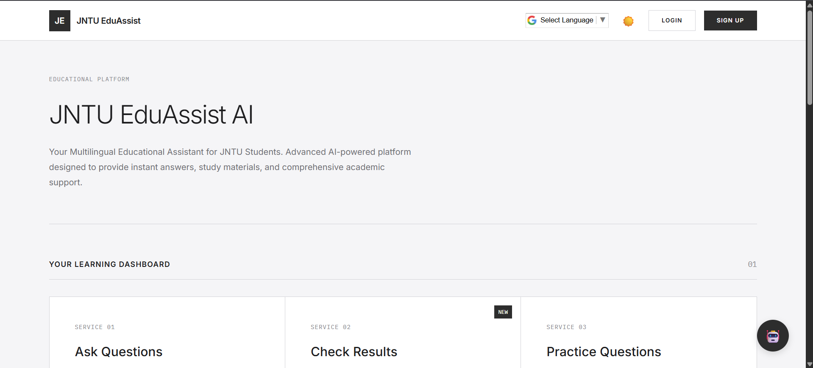
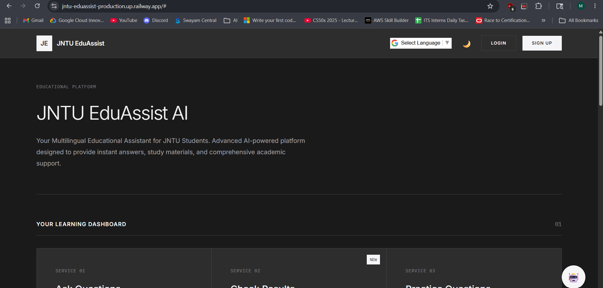
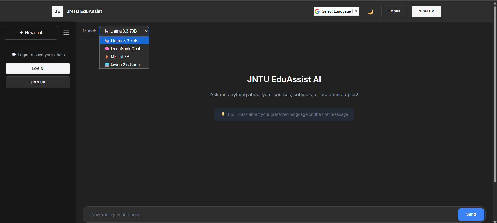
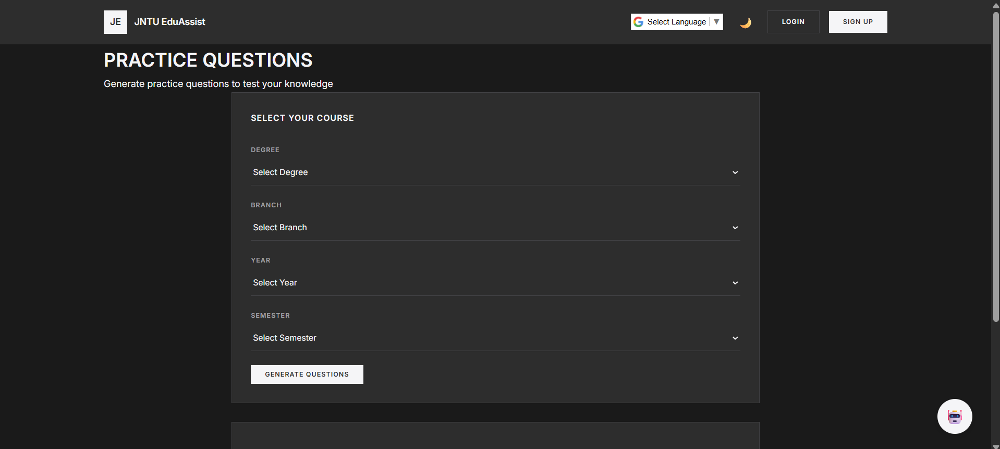
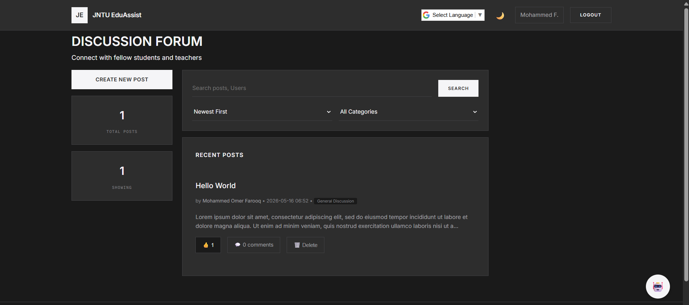
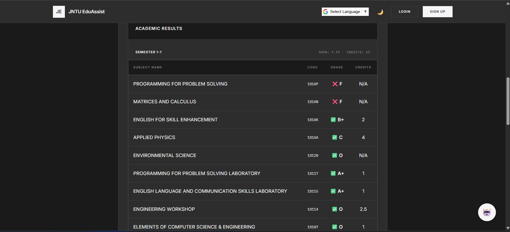
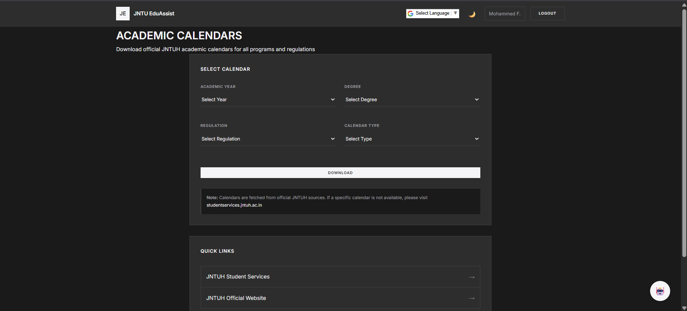
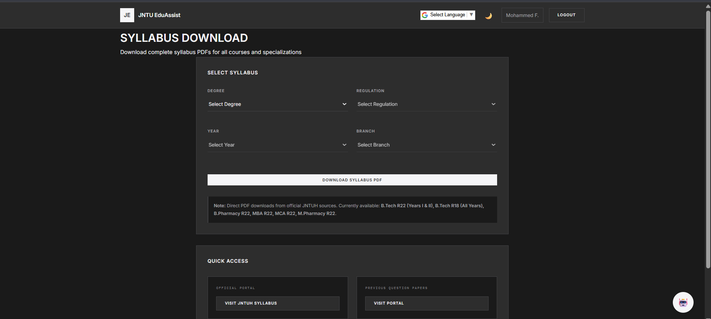

# JNTU EduAssist Platform

Multilingual AI-powered academic platform for JNTU students featuring AI assistance, academic services integration, discussion forums, practice systems, and multilingual learning support.

---

## Overview

JNTU EduAssist Platform is an AI-powered educational ecosystem designed to simplify academic workflows for JNTU students.

The platform combines:
- AI-powered academic assistance
- Direct JNTU results integration
- Practice question generation
- Academic calendar access
- Syllabus and resource downloads
- Student discussion forums
- Multilingual learning support

into one centralized platform.

---

# Live Demo

🚀 Live Website:  
```txt
https://jntu-eduassist-production.up.railway.app/
```

---

# Features

## AI Academic Assistant

Students can ask academic questions and receive instant responses using multiple AI models.

### Supported Models
- Qwen
- DeepSeek
- Groq Llama
- Groq Mixtral
- KAT-Coder

The platform allows users to choose different models depending on coding, academic, or conversational needs.

---

## JNTU Results Integration

Fetch academic results directly from JNTU servers using integrated APIs.

### Features
- Quick result lookup
- Simplified access workflow
- Faster academic access
- Integrated directly into the platform

---

## Practice Question Generator

Generate practice questions to improve preparation and self-assessment.

### Includes
- Subject-wise questions
- Exam preparation support
- Revision assistance
- Self-assessment workflows

---

## Student Discussion Forum

A built-in academic social platform where students can interact and collaborate.

### Forum Features
- User authentication
- Create posts
- Comment on discussions
- Like and share posts
- Follow and unfollow users
- Academic collaboration

---

## Academic Calendars

Students can directly access official JNTU academic calendars from within the platform.

---

## Syllabus & Resources

The platform provides:
- Syllabus downloads
- Previous year question papers
- Official JNTU PDF resources
- Academic materials access

---

## Multilingual Support

Students can interact with the platform in multiple languages for improved accessibility and learning experience.

---

# Screenshots

## Home Dashboard (Light Mode)



---

## Home Dashboard (Dark Mode)



---

## AI Assistant



---

## Practice Questions



---

## Discussion Forum



---

## Results Integration



---

## Academic Calendars



---

## Syllabus Downloads



---

# Tech Stack

## Frontend
- HTML
- CSS
- JavaScript

## Backend
- Python
- Flask

## AI & Retrieval
- OpenRouter APIs
- Multiple LLM integrations
- Embedding-based retrieval
- ChromaDB

## Deployment
- Railway
- Render

---

# Project Structure

```txt
jntu-eduassist-platform/
│
├── assets/
│   └── Screenshots/
│
├── eduassist/
├── static/
├── templates/
│
├── app.py
├── main.py
├── embedding_service.py
├── requirements.txt
├── pyproject.toml
├── render.yaml
└── README.md
```

---

# Getting Started

## Clone the Repository

```bash
git clone https://github.com/omermohammedfarooq/jntu-eduassist-platform.git
cd jntu-eduassist-platform
```

---

## Install Dependencies

```bash
pip install -r requirements.txt
```

---

## Run the Application

```bash
python app.py
```

---

# Environment Variables

Create a `.env` file and add your API keys.

Example:

```env
OPENROUTER_API_KEY=
GROQ_API_KEY=
SECRET_KEY=
```

---

# Future Improvements

- OCR-based handwritten answer evaluation
- Voice input support
- Personalized dashboards
- Better multilingual support
- AI-generated study plans
- Advanced syllabus integration
- Mobile responsiveness improvements
- Student analytics dashboard

---

# Vision

The goal of this project is to build a centralized AI-powered academic ecosystem for JNTU students where they can:

- Access academic resources
- Ask questions instantly
- Prepare for examinations
- Collaborate with peers
- Simplify academic workflows

through a single unified platform.

---

# Status

🚧 This project is actively under development.

---

# License

MIT License
